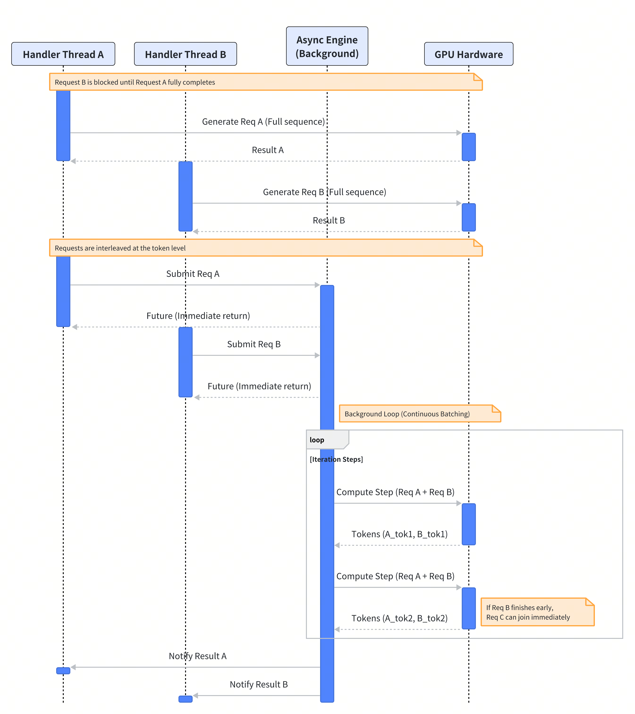
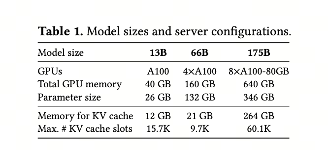
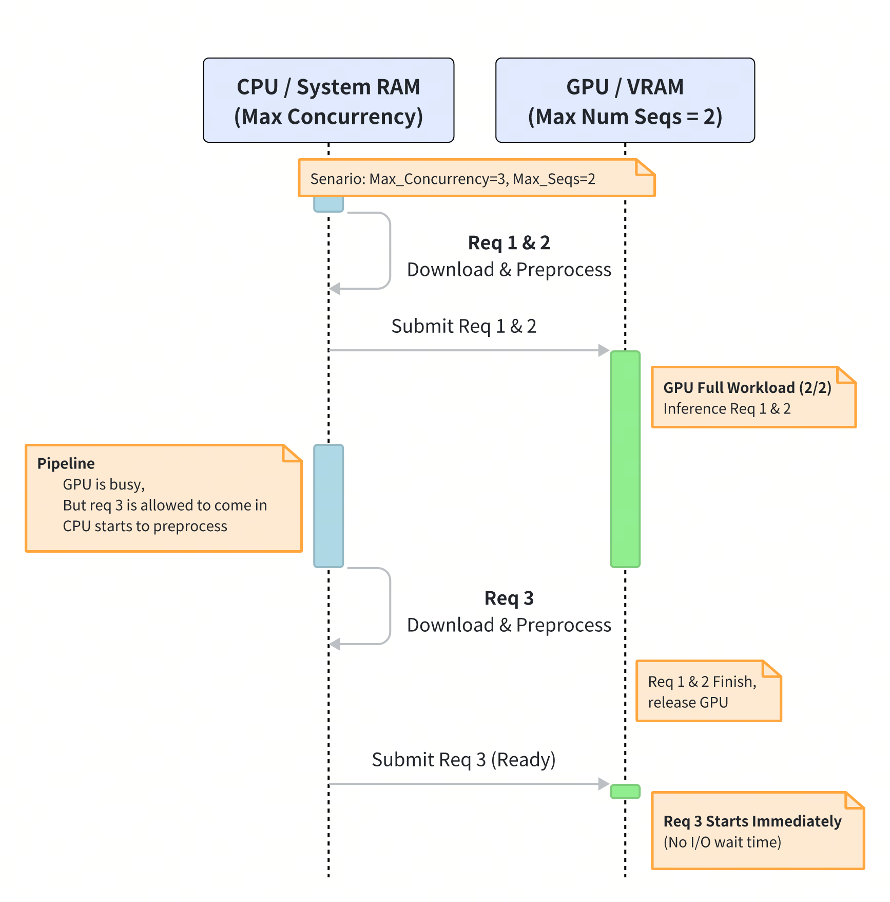
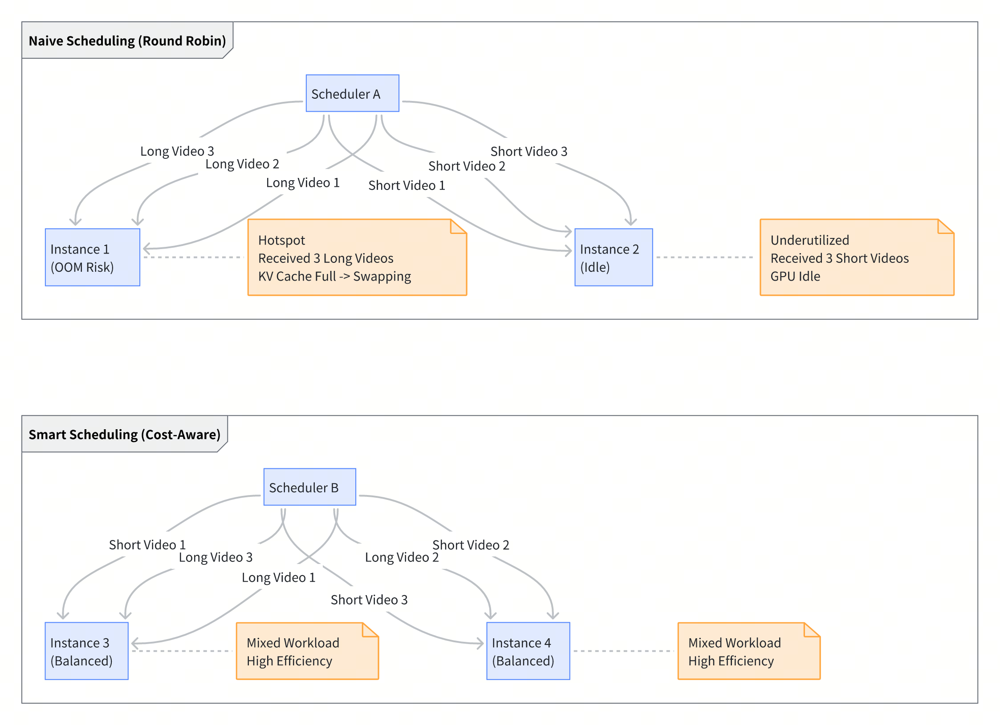
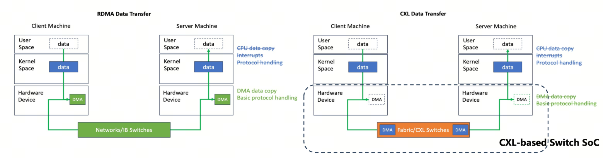
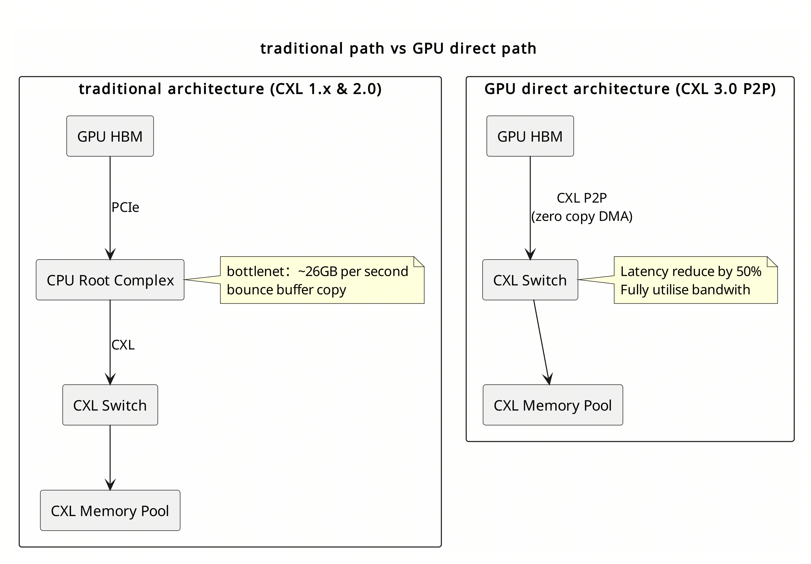
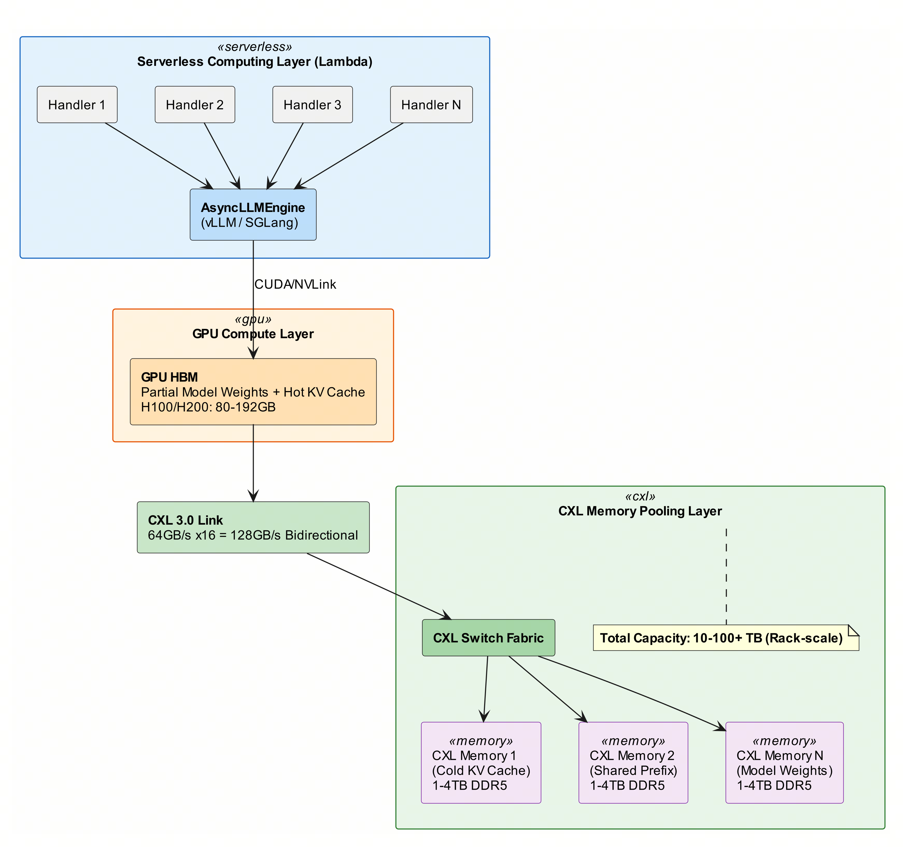
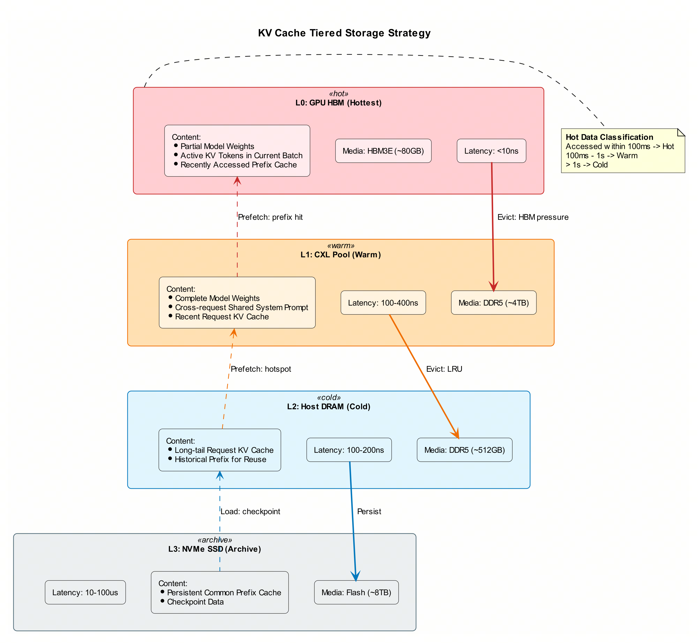
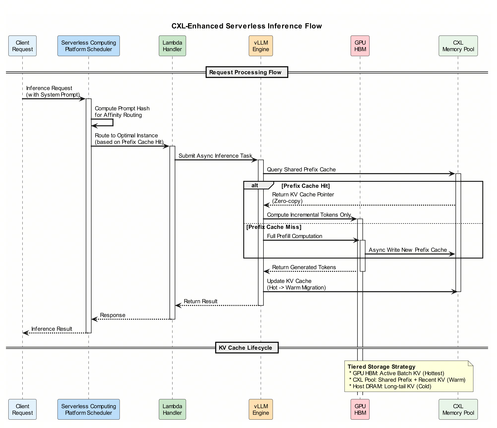

# Serverless GPU Inference: Dev Guide & Next-Gen CXL-Based Architecture

# Preface: Evolution and Challenges of AI Inference Infrastructure in 2026

With the rapid iteration of large models and their infrastructure, the field of artificial intelligence has entered a critical phase characterized by both explosive demand and intense competition. The year 2026 marks a pivotal turning point in model architecture and inference facilities. The emergence of a new generation of ultra-large-scale models (with parameter counts exceeding 400B and single model weights exceeding 500GB) is forcing system architectures to evolve from traditional compute-intensive paradigms to complex memory and bandwidth-intensive paradigms, posing severe challenges to existing hardware-software co-design.

According to MarketsandMarkets projections, the AI inference market is expected to grow from $106.15 billion in 2025 to $254.9 billion in 2030, with a compound annual growth rate of 19.2% [8]. In this computing revolution, **memory is replacing computation as the new bottleneck**—GPU computing power growth far exceeds HBM memory bandwidth and capacity growth, creating an increasingly severe "Memory Wall" problem.

Through research and analysis of technological trends in this field, this article aims to facilitate the architectural evolution of the Serverless Computing platform, enabling it to effectively respond to technological changes and provide reference ideas for subsequent system optimization.

**This Article is divided into two parts:**

- **Part One**: Introduces how to leverage the advanced capabilities of the Serverless Computing platform, combined with inference engines such as vLLM/SGLang, to achieve optimal batch processing within a single instance, maximizing GPU utilization and reducing inference latency
- **Part Two**: Introduces the design of next-generation Serverless Computing inference architecture based on CXL (Compute Express Link), preparing for the upcoming era of ultra-large models

# Part One: Development Guide—Efficient GPU Inference Based on Serverless Computing

## 1. Motivation & Background

**Advanced Serverless Computing platforms** typically provide users with convenient one-stop development and deployment capabilities for operators and workflows, flexible workflow/dynamic DAG orchestration and execution capabilities, fine-grained fault recovery, heterogeneous resource task scheduling and management capabilities, massive offline task processing capabilities, and underlying Serverless computing capabilities, making the architecture naturally suited for Serverless Inference scenarios.

Combined with advanced features provided by the platform, such as operator resource exclusive reuse, resource exclusivity, and operator single-task multi-concurrency, they offer more flexible development capabilities and more optimization space beyond traditional Serverless Inference.

However, when developing and deploying large model inference operators on the Serverless Computing platform, developers typically face two core challenges: **low resource utilization** and **high end-to-end latency**.

Traditional development patterns usually treat model inference as a synchronous function call. However, GPUs are highly parallelized hardware, and LMM inference has alternating characteristics of "compute-intensive" and "memory-intensive." If each Handler instance can only process one request serially, GPU computing power is largely wasted during I/O waiting or generation gaps, and it cannot handle burst traffic.

**This article is divided into two parts**

1. **The first part aims to introduce**

   1. How to leverage the platform's **operator resource exclusive reuse** and **single-task multi-concurrency** features, combined with industry-leading inference engines (vLLM / SGLang), to achieve **optimal batch processing within a single instance**, thereby maximizing GPU utilization and reducing inference latency.
   2. Development guidelines for distributed multi-GPU inference scenarios
2. **The second part aims to introduce**

   1. Next-generation Serverless Computing inference architecture design based on CXL

## 2. Core Component Introduction

### 2.1 Traditional Frameworks: PyTorch & TensorFlow

- **Positioning**: General-purpose deep learning research and training frameworks.
- **Limitations in Inference**: Default to Eager Mode (dynamic graph) execution, lacking memory optimization for LLM generation processes. If directly using `model.generate()`, typically only static batches can be processed (leading to memory fragmentation + tail blocking), making it difficult to handle dynamic scenarios with varying request lengths, and KV Cache memory consumption is huge, easily causing OOM.

### 2.2 Specialized Inference Frameworks: vLLM & SGLang

To address efficiency issues during the serving phase, specialized inference frameworks have emerged in the industry:

- **vLLM**: Currently the most mainstream LLM/LMM inference engine in the industry.

  - **Core Advantage**: Through **PagedAttention** technology, it manages KV Cache like an operating system manages memory, almost eliminating memory fragmentation and supporting extremely high throughput.
- **SGLang**: High-performance inference framework based on **RadixAttention** mechanism

  - **Core Advantage**: Building on **PagedAttention**, it automatically manages **KV Cache matching and recycling** through **RadixTree**, achieving ultimate inference acceleration for complex structured output (JSON) and multi-turn dialogue (Prefix Caching) scenarios.
- **Comparison**: Compared to PyTorch/TF, vLLM and SGLang can provide 2-10x throughput improvement on the same hardware. vLLM has a more mature ecosystem, while SGLang is faster in specific scenarios (such as automatic long context reuse).

## 3. Why Use vLLM?

Understanding vLLM's mechanism is a prerequisite for writing high-performance GPU inference operators.

### 3.1 Iteration-level Scheduling

Traditional batch processing must wait for the longest request in the batch to finish generating before all requests can return (barrel effect). vLLM introduced iteration-level scheduling: the engine reschedules after **each token generation (Iteration)**. If request A finishes generating first, it immediately exits the batch, and new request C can immediately take its place.

### 3.2 Continuous Batching

Requests don't need to wait for a full batch before starting. As long as GPU memory has spare capacity, new requests are immediately inserted into the running inference process.

### 3.3 PagedAttention

In traditional inference frameworks (such as native PyTorch), KV Cache is stored in **contiguous memory space**. This approach, similar to early operating system memory management, leads to severe memory issues:

- **Memory Fragmentation**: Since output lengths are unpredictable, the system must reserve memory space for the maximum length, causing large amounts of memory to be occupied but not actually used.
- **Inability to Share**: During Parallel Sampling or Beam Search, identical Prompt portions cannot share KV Cache, causing resource waste.

**Core Idea of PagedAttention:** Inspired by operating system **virtual memory**, vLLM divides each request's KV Cache into fixed-size "Blocks/Pages."

- **Non-contiguous Storage**: KV Cache no longer requires physically contiguous space but can be scattered across various memory locations.
- **On-demand Allocation**: New physical blocks are allocated only when generating new tokens requires space.
- **Near-zero Waste**: Except for minimal internal fragmentation in the last block, memory utilization approaches 100%.
- **Efficient Sharing**: Identical prefixes across different requests can point to the same physical block, greatly saving space when processing long texts or complex tasks.

### 3.4 Multi-GPU Distributed Inference (Advantages of Multi-GPU Distributed Inference)

vLLM natively supports **Tensor Parallelism** and **Pipeline Parallelism**, enabling the distribution of computational load and memory requirements of ultra-large-scale models (such as Llama-3-405B) evenly across multiple GPUs. Its core advantage lies in deep integration with the **Ray framework** for multi-node orchestration and the use of custom CUDA kernels to optimize **All-Reduce communication**, greatly reducing synchronization latency between GPUs. Meanwhile, the PagedAttention mechanism remains effective in distributed scenarios, supporting unified KV Cache management and prefix cache sharing across GPUs, ensuring that multi-GPU clusters maintain extremely high memory utilization and throughput when handling high-concurrency, long-text tasks.

### 3.5 CPU Swapping (Memory Offloading)

If burst traffic fills up GPU memory with KV Cache, vLLM doesn't crash directly (OOM), but instead **Swaps** some paused requests' KV Cache to CPU memory for temporary storage, loading them back to continue generation once GPU memory is freed. This ensures system robustness.

Note that requests subjected to CPU swapping will introduce noticeable latency, but subsequent sections will explain how to configure properly to minimize this.

### 3.5 Summary

From this, we can understand that compared to traditional inference frameworks, vLLM's core advantage lies in thoroughly solving the memory fragmentation problem through PagedAttention, combined with Iteration-level Scheduling to achieve a leap from "static batching" to "dynamic/iteration-level batching." This not only eliminates the Head-of-line Blocking problem, ensuring full utilization of GPU computing power, but also provides excellent system robustness and inference throughput in complex long-text and high-concurrency scenarios.

## 4. Core Optimization: Traditional "Single Request-Single Model" Mode

**First, let's explain two terms**

> **One-sentence explanation of what is Serverless Computing operator resource exclusive reuse?**
> The Serverless Computing platform operator's underlying runtime uses Lambda. In traditional Serverless computing, resources are released when the operator exits. Operator container exclusive reuse can be understood as transforming a stateless function computation into a stateful server, allowing the operator to pre-load global Python modules in the container before running, running the operator Handler through thread or fork process during runtime, and not exiting the container after running, caching global modules for reuse by the next invocation. After enabling operator exclusive reuse, only the same type of operator can run within a single host machine to avoid memory leak issues.

> **One-sentence explanation of what is operator handler Runtime mode?**
> As mentioned above, after enabling exclusive reuse, the operator runs the operator Handler through thread or fork process during runtime, where thread mode allows creating and modifying global Python modules within the handler. The process method can only load global modules through Copy On Write within the handler and cannot modify global modules.

**The following is an example of an operator with resource exclusive reuse enabled using thread Handler Runtime mode**


In summary, after enabling the platform's operator resource exclusive reuse capability, combined with the operator handler Thread / Process Runtime mode, model parameter memory can be pre-loaded globally, containers remain resident on the host machine, and each subsequent new request can reuse the global model memory for direct inference. In Serverless Inference Computing scenarios, this avoids the time-consuming process of repeatedly loading models during cold starts.

---

**The above is the first step of optimization. Below we continue to explain how to further improve GPU utilization and inference latency using the previously mentioned VLLM features.**

**Before the platform supported operator single-task multi-concurrency**, users typically designed operators this way:

> - Handler initializes a `vllm.LLM` object.
> - Request arrives -> `llm.generate(prompt)` -> **blocking wait** -> return result.
> - **Consequence**: Even if the platform allows this instance to process 5 requests simultaneously, since `llm.generate` is synchronously blocking, these 5 requests can only **execute serially in queue**.
> - **Resource Waste**: Each request exclusively occupies the entire 7B/70B model's memory, but the compute units are idle most of the time.

### 4.1 Best Practice: Concurrent Inference with Shared Model Memory


To fully leverage vLLM's above features, **the platform's operator single-task multi-concurrency feature needs to be enabled (part 6)**.

> **One-sentence explanation of what is operator single-task multi-concurrency?**
> A container is no longer limited to running only one operator task, but can concurrently run multiple operator tasks in the form of processes/threads (each operator Handler Execution is considered a task)

**Architecture Change:** No longer "one request exclusively occupies one model," but **"multiple request threads share the same asynchronous inference engine"**.

1. **Single Instance Multi-threading**: Platform-side configuration allows a single operator instance to simultaneously launch multiple Handler threads, concurrently processing multiple inference requests.
2. **Shared Engine**: All threads submit tasks to the same global singleton `AsyncLLMEngine`.
3. **Automatic Batching**: vLLM automatically merges the Prompts submitted by these N threads for computation, achieving extremely high throughput.

### 4.2 Shared Context Optimization Based on APC

After enabling the "single instance multi-threaded concurrency" mentioned above, we found that in actual business scenarios, multiple requests entering concurrently often carry **identical System Prompts**.

In high-concurrency scenarios, if vLLM still independently calculates and stores the KV Cache for this common prefix for each request, it will cause memory waste and redundant computation. Therefore, we need to leverage vLLM's **Automatic Prefix Caching (APC)** feature to further optimize performance.

- **Pain Point Analysis**: In traditional mode, if 10 concurrent requests contain the same System Prompt, the GPU needs to repeat Prefill computation 10 times and occupy 10 portions of memory space.
- **Optimization Mechanism**:

  - **Global KV Hash Table**: vLLM hashes KV Blocks. When detecting that different requests have the same prefix (such as a unified System Prompt), the engine automatically matches existing Blocks in global memory.
  - **Write-Once-Read-Many**: The common prefix's KV Cache only needs to be computed once (Prefill) when the first request arrives, and all subsequent concurrent requests will directly reference that physical memory block through pointers, **skipping the computation process**.
- **Benefits**:

  1. **Reduces Prefill time and Time To First Token (TTFT) for subsequent requests**
  2. **Improves memory utilization**
- **Supplement:**

  1. SGLang's **RadixAttention** takes this sharing to the extreme. In SGLang, this tree-like reuse is native and more deeply optimized.

## 5. Code Migration Guide



### 5.1 Old Code (Synchronous/Blocking - Needs Refactoring)

```python
# Requests are serial, cannot leverage concurrency
from vllm import LLM

# Global initialization (or lazy loading)
llm = LLM(model="...") 

def handler(event, context):# The generate here will block
    output = llm.generate(event['prompt']) 
    return output
```

### 5.2 New Code (Asynchronous/Concurrent - Best Practice)

Uses `AsyncLLMEngine` and background event loop, combined with platform-side multi-threaded concurrent calls.

If different requests share the same or several system prompt prefixes, prefix caching should be enabled (enable_prefix_caching) to share system prompt context and further accelerate inference.

```python
# Best Practice: Supports concurrent inference, automatic Batching
import asyncio
import threading
import uuid
from vllm.engine.async_llm_engine import AsyncLLMEngine
from vllm.engine.arg_utils import AsyncEngineArgs

# --- Global variables ---
_ENGINE = None
_LOOP = None

def _start_background_loop(loop):
    """Run asyncio event loop in background thread"""
    asyncio.set_event_loop(loop)
    loop.run_forever()

def get_engine():
    global _ENGINE, _LOOP
    if _ENGINE: return _ENGINE, _LOOP
    
    # 1. Initialize async engine (note configuring max_num_seqs to control maximum concurrency)
    engine_args = AsyncEngineArgs(
        model="/opt/model/path",
        gpu_memory_utilization=0.95, # Reserve memory for model and KV Cache
        max_num_seqs=8,              # Allow vLLM to internally process how many requests simultaneously
        enable_prefix_caching=True,  # Must be set to True to automatically share System Prompt
        disable_log_requests=True
    )
    _ENGINE = AsyncLLMEngine.from_engine_args(engine_args)
    
    # 2. Start background Loop thread, don't block Handler main thread
    _LOOP = asyncio.new_event_loop()
    t = threading.Thread(target=_start_background_loop, args=(_LOOP,), daemon=True)
    t.start()
    
    return _ENGINE, _LOOP

# --- Connect synchronous Handler and asynchronous Engine ---
async def _generate_stream(engine, prompt, request_id, params):
    results_generator = engine.generate(prompt, params, request_id)
    final_output = None
    # Async iteration until generation ends
    async for request_output in results_generator:
        final_output = request_output
    return final_output

# --- User Handler Entry ---
# Platform-side configuration: Concurrency > 1 (e.g., 8)
def handler(event, context):
    engine, loop = get_engine()
    request_id = str(uuid.uuid4())
    
    # 1. Append inference task to background Loop
    # This step is non-blocking, multiple Handler threads can submit multiple tasks instantly
    future = asyncio.run_coroutine_threadsafe(
        _generate_stream(engine, event['prompt'], request_id, sampling_params),
        loop
    )
    
    # 2. Block waiting for result (meanwhile GPU is processing other threads' requests in parallel)
    # vLLM internally automatically performs Batch Processing on these concurrent requests
    result = future.result() 
    
    return parse_result(result)
```

### 5.3 Multi-GPU Inference Scenarios

In some ultra-large model inference scenarios, single GPU memory is insufficient to accommodate the entire model parameters, requiring distributed multi-GPU model parallel inference. vLLM naturally supports this scenario well.

**What is Model Parallelism (TP)?**

Simply put, it's "cutting open" a huge neural network.

- **Splitting Weights:** If a matrix multiplication A X W is too large, TP will vertically split the weight matrix W into [W_1, W_2], placing them on GPU1 and GPU2 respectively.
- **Parallel Computation:** GPU1 computes A X W_1, GPU2 computes A X W_2.
- **Communication Merge:** Finally, results are combined through high-speed communication (All-Reduce).

**Core Benefits:**

- **Memory Stacking:** Two 24GB GPUs can run a 30GB model.
- **Computation Acceleration:** Two GPUs computing together usually improves generation speed (Tokens/s) (although there's communication overhead, for large models the benefits outweigh the costs).

```python
import asyncio
import threading
import uuid
import os
import torch
from vllm.engine.async_llm_engine import AsyncLLMEngine
from vllm.engine.arg_utils import AsyncEngineArgs

# --- Global variables ---
_ENGINE = None
_LOOP = None

def _start_background_loop(loop):
    asyncio.set_event_loop(loop)
    loop.run_forever()

def get_engine():
    global _ENGINE, _LOOP
    if _ENGINE: return _ENGINE, _LOOP
    
    # Strategy: Automatically detect how many GPUs are in the environment and use that many for parallelism
    # Can also override via environment variable: os.getenv("TP_SIZE", 1)
    available_gpus = torch.cuda.device_count()
    print(f"Detected {available_gpus} GPUs")

    # --- Core Configuration ---
    engine_args = AsyncEngineArgs(
        model="/path/to/your/model", 
        
        # Set tensor parallelism degree
        # If you have 4 GPUs, set this to 4, vLLM will automatically split the model across 4 GPUs
        tensor_parallel_size=available_gpus, 
        
        # Memory control
        # In multi-GPU mode, each GPU needs to reserve memory for Model Partition, NCCL communication library and KV Cache
        # Recommended not to exceed 0.90, otherwise may cause OOM or NCCL initialization failure
        gpu_memory_utilization=0.90, 
        
        # Distributed backend
        # "ray" is recommended. It's more robust than Python native multiprocessing, better handles deadlocks and dirty process cleanup
        distributed_executor_backend="ray",
        
        # Other configurations
        max_num_seqs=4,
        enable_prefix_caching=True,
        disable_log_requests=True,
        trust_remote_code=True
    )
    
    # Initialize engine
    # This step will be slower because it needs to start Ray worker processes and load the model on multiple GPUs
    _ENGINE = AsyncLLMEngine.from_engine_args(engine_args)
    
    # Start background Loop
    _LOOP = asyncio.new_event_loop()
    t = threading.Thread(target=_start_background_loop, args=(_LOOP,), daemon=True)
    t.start()
    
    return _ENGINE, _LOOP

# Handler logic remains the same as before, no modification needed
# When called externally, vLLM internally automatically handles multi-GPU distribution and result aggregation
```

**Notes**

- **Model Splitting Limitation:** `tensor_parallel_size` must be divisible by the total number of Attention Heads in the model.

  - Most mainstream models (Llama, Qwen) have Head counts of 32, 40, 64, etc., which are even numbers typically divisible by 2, 4, 8.
  - If you want to run TP with 3 GPUs, it will most likely error because the Head count cannot be evenly divided.
- **Operator needs to install Ray (pip install ray)**

## 6. Operator Single-Task Multi-Concurrency

1. **Platform Feature:** The platform supports concurrent invocation of operator Handlers, exposed to users through configuration
   **Note:** This configuration is strongly related to VLLM's `max_num_seqs` setting and can be understood as a soft rate limit. If operator concurrency is less than `max_num_seqs`, it will synchronously limit `max_num_seqs`.
   During the initial phase of developers using the operator concurrent invocation feature to develop operators, before finding the optimal configuration for operator concurrency and `max_num_seqs`, a series of experiments are usually needed. These two configurations directly affect GPU memory and CUDA core utilization, as well as inference end-to-end latency and throughput. Developers should flexibly configure based on different inference scenarios and resources.

**Below is a configuration example.** Assume a user wants to develop a GPU operator using a 500GB parameter model for VLLM inference, with each inference requiring an average of 100GB KV Cache. The user can configure eight H20 GPUs for the operator (totaling 800GB memory), with 500GB as static model parameter memory loaded globally, 300GB as KV Cache memory, and concurrency = 300GB / 100GB = 3.

<u>(This can actually be set to 4, because the video may need to undergo video downloading, decoding, frame extraction and other preprocessing before being sent to the VLLM inference queue)</u>

Then the user can enable operator exclusive resource reuse, set the operator Handler execution mode to Thread, and single-task concurrency to 3.

Operator resources are set to 32 CPU cores, 128GB memory, 8 H20 GPUs.

**Note: After the operator task loads, it will immediately occupy all 8 GPUs, 32 CPU cores and 128GB memory resources. 3 Handler threads share and compete for resources. This design is consistent with mainstream inference engines like VLLM / SGLang (inference engines hold all declared resources at once during loading, and different sequences in each batch compete for resources together)**

## 7. Configuration and Operations Notes

- **Executor Mode**: **Choose Thread Mode/Process Mode**
- **Exclusive Container Reuse**: Operator enables **exclusive container reuse**
- **Concurrency Configuration (varies by inference scenario, for reference only)**:

  - **single_task_multi_concurrency (Platform-side)**: Users need to configure based on experiments. Too high may cause insufficient memory/CPU memory, thereby increasing Latency. Too low will cause insufficient memory utilization. Recommended to start with 4-8 and tune based on experimental results.
  - **max_num_seqs (vLLM-side)**: Set `max_num_seqs` in code. When concurrent requests exceed this value, vLLM will put excess requests in a waiting queue to prevent GPU memory overflow. Recommended to start with a value equal to or slightly lower than Max Concurrency.
- **Configuration Example (varies by inference scenario, for reference only):**

  - Assume the operator carries a 7B model, requiring 15GB memory to load
  - Operator configuration: Thread mode + exclusive container reuse
  - Operator resources = 1 A10 GPU (24GB memory)
  - gpu_memory_utilization = 0.95 (Reserve 24GB * 0.95 = 22.8 GB for model and KV Cache)
  - Model 15GB, remaining 22.8 - 15 = 7.8 GB for inference
  - Set max_num_seqs = 4, inference engine processes maximum four inference requests simultaneously, competing for 7.8GB memory
  - Set operator **single_task_multi_concurrency** = 5, operator processes maximum 5 requests concurrently (one can do video download/preprocessing while queuing).
- **Other References**

  - The following are experimental configurations from the original VLLM Paper. Different inference scenarios, such as pure text/multimodal/different models and prompt sizes will vary, for reference only.
    
    



## 8. Conclusion

In summary, following the above development specifications, using the same resource scale to perform inference on a large number of requests can significantly improve GPU utilization and reduce inference latency (through System Prompt Context reuse and concurrency improvement to reduce queuing time).

## 9. Future Optimization Space: Inference Engine Introduction, Affinity Scheduling, Load-Based Intelligent Scheduling

- **A/B Testing (vLLM vs SGLang)**:

  - **Current State**: vLLM is currently the most compatible and stable throughput general standard.
  - **Challenge**: In complex Agent interaction or structured output scenarios, **SGLang** can often provide lower Time To First Token (TTFT) with its unique **RadixAttention** mechanism and multimodal-targeted Kernel optimizations.
  - **Recommendation**: It's recommended that users encapsulate SGLang Runtime based on the `AsyncLLMEngine` interface pattern recommended in this document. Compare both through A/B experiments on **TP99 Latency** and **memory fragmentation rate** with specific business data, choosing the engine most suitable for business characteristics.
- **Affinity Scheduling Based on Prefix Caching**

  - **Principle**: Both vLLM (through APC) and SGLang (through RadixAttention) support reusing Prompt KV Cache.
  - **Strategy**: For requests with the same System Prompt or highly overlapping User Prompt prefixes (such as fixed template video understanding), the platform scheduler should implement **Hash-based Affinity**, routing such requests to the same operator instance, thereby skipping repeated Prefill computation and significantly reducing latency.
- **Prompt-Size Aware Scheduling**

  - **Pain Point: Workload Skew**. Each multimodal request's Prompt Size depends on video length and resolution, with great randomness.
    - _Scenario_: If the scheduler only does round-robin based on "request count," instance A may happen to be assigned multiple ultra-long videos (High Load), while instance B is assigned multiple short videos (Low Load).
    - _Consequence_: Instance A triggers **CPU Swapping** due to KV Cache exhaustion, causing latency spikes; while instance B has idle memory, wasting resources.
  - **Solution: Cost-Based Load Balancing**. Future schedulers should parse the Prompt's Estimated Token Cost before routing.
    - **Strategy**: Adopt **"Least Loaded (by Tokens)"** strategy, scheduling ultra-long video requests to instances with sufficient memory, trying to keep each instance's **memory pressure** and **computational load** balanced, avoiding single-point Swapping.



## 10. Part One Summary and Outlook

Following the above development specifications, using the same resource scale to perform inference on a large number of requests can significantly improve GPU utilization and reduce inference latency (through System Prompt Context reuse and concurrency improvement to reduce queuing time).

However, as model scales evolve from 7B, 70B to 400B+, and context lengths evolve from 4K to 100K, 1M, **the memory bottleneck facing the current architecture will become increasingly severe**:

<table>
<tr>
<td>**Challenge**<br/></td><td>**Current Status**<br/></td><td>**Impact**<br/></td></tr>
<tr>
<td>Limited HBM Capacity<br/></td><td>H100 only 80GB<br/></td><td>Cannot accommodate ultra-large model weights + long context KV Cache<br/></td></tr>
<tr>
<td>High HBM Cost<br/></td><td>Each GB HBM consumes 3x DDR5 wafer area<br/></td><td>TCO remains high<br/></td></tr>
<tr>
<td>Frequent CPU Swapping<br/></td><td>Common in long context scenarios<br/></td><td>Unpredictable latency<br/></td></tr>
</table>

**Next-Generation Solution: CXL Memory Pooling**

CXL (Compute Express Link) technology is becoming the key technology for breaking through the memory wall [1]. In Part Two, we will detail:

- CXL technology principles and evolution path
- CXL application scenarios in AI inference
- How to integrate CXL into the Serverless Computing platform
- Expected benefits and implementation path

# Part Two: Next-Generation Serverless Computing Platform Inference Architecture Based on CXL

## 1. Background: The Memory Crisis in AI Inference

### 1.1 Memory Requirements of Next-Generation Ultra-Large Models

In 2026, we are witnessing another leap in large model parameter scales:

<table>
<tr>
<td>**Model**<br/></td><td>**Parameters**<br/></td><td>**Weight Size (FP16)**<br/></td><td>**Single Request KV Cache (100K tokens)**<br/></td></tr>
<tr>
<td>Llama 3.1 70B<br/></td><td>70B<br/></td><td>140GB<br/></td><td>~8GB<br/></td></tr>
<tr>
<td>Llama 3.1 405B<br/></td><td>405B<br/></td><td>810GB<br/></td><td>~50GB<br/></td></tr>
<tr>
<td>Llama 4 Maverick<br/></td><td>400B<br/></td><td>800 GB<br/></td><td>~50GB<br/></td></tr>
<tr>
<td>Next Generation<br/></td><td>TBD<br/></td><td>TBD<br/></td><td>TBD<br/></td></tr>
</table>

Taking Llama 4 Maverick as an example, model weights alone require 800GB of memory. Even using 8 H100 GPUs (totaling 640GB HBM), aggressive quantization strategies are needed to barely fit the model, with almost no space for KV Cache.

### 1.2 HBM Supply-Demand Dilemma

HBM (High Bandwidth Memory) is the mainstream memory solution for current AI accelerators, but its limited supply and high cost are becoming major bottlenecks for AI inference scaling.

**Cost Comparison [9]**:

<table>
<tr>
<td>**Memory Type**<br/></td><td>**Bandwidth**<br/></td><td>**Cost per GB**<br/></td><td>**Capacity Limit**<br/></td></tr>
<tr>
<td>HBM3E<br/></td><td>4.8TB/s<br/></td><td>$50-100<br/></td><td>Limited by packaging<br/></td></tr>
<tr>
<td>DDR5-6400<br/></td><td>51.2GB/s/channel<br/></td><td>$3-5<br/></td><td>Server slot limitation<br/></td></tr>
<tr>
<td>CXL 2.0/3.0 DDR5<br/></td><td>64-128GB/s (x16)<br/></td><td>$5-15<br/></td><td>100TB+/cluster<br/></td></tr>
</table>

CXL memory costs approximately 1/10 of HBM, and capacity can scale to cluster level. For scenarios like KV Cache that are capacity-sensitive but have relatively lower bandwidth requirements, CXL provides a viable expansion path.

## 2. CXL Technology Overview

### 2.1 What is CXL?

Compute Express Link (CXL) is an open interconnect standard built on the PCIe physical layer, providing Cache Coherency and Memory Semantics access capabilities between CPUs and devices.

The CXL Consortium was founded in 2019, with founding members including Alibaba, Meta, Google, Intel, Microsoft, and others [1].



### 2.2 Three Sub-protocols of CXL

<table>
<tr>
<td>**Protocol**<br/></td><td>**Function**<br/></td><td>**Typical Scenarios**<br/></td></tr>
<tr>
<td>CXL.io<br/></td><td>Device discovery, configuration, DMA (PCIe-based)<br/></td><td>All CXL devices<br/></td></tr>
<tr>
<td>CXL.cache<br/></td><td>Device caches host memory<br/></td><td>Accelerator accessing Host Memory<br/></td></tr>
<tr>
<td>CXL.mem<br/></td><td>Host accesses device memory<br/></td><td>Memory expansion, KV Cache offloading<br/></td></tr>
</table>

### 2.3 CXL Device Types

- **Type 1** (CXL.io + CXL.cache): Smart NICs, etc., no local memory
- **Type 2** (CXL.io + CXL.cache + CXL.mem): GPUs, FPGAs, with local memory
- **Type 3** (CXL.io + CXL.mem): Memory expansion devices, **AI inference scenarios mainly focus on this type**

## 3. CXL Technology Evolution

### 3.1 CXL 1.0/1.1 (2019)

**Problems Solved**: Before CXL, CPU access to accelerator (such as GPU, FPGA) memory required PCIe DMA, with high software overhead and latency. Accelerator access to host memory also required explicit data copying, unable to achieve cache coherency.

- Based on PCIe 5.0 physical layer, 32GT/s
- Defined three sub-protocols and three device types
- CPU and devices can directly access each other's memory through Load/Store instructions, with hardware automatically maintaining cache coherency

**Limitation**: Only supports point-to-point connections, cannot achieve multi-host shared memory.

### 3.2 CXL 2.0 (2020)

**Problems Solved**: CXL 1.x only supports point-to-point connections, with each server's memory independent. When some nodes have insufficient memory, they cannot borrow idle memory from other nodes, resulting in low resource utilization.

**Core Features**:

- Introduced **CXL Switch**, supporting multiple hosts connecting to the same memory pool
- Supports **Memory Pooling**: Memory resources can be allocated on-demand among multiple hosts
- Supports virtualization of a single physical device into multiple logical devices (MLD)

**Industry Practice: Alibaba Cloud PolarDB** (SIGMOD 2025 Best Paper)

Alibaba Cloud built the PolarCXLMem distributed memory pool based on CXL 2.0 [3]:

- Multiple compute nodes connect to a shared memory pool through CXL Switch
- Compared to RDMA solution, cross-machine latency reduced from microsecond level to hundreds of nanoseconds
- IO-Bound scenario performance improved 100%+, cost reduced 50%

This practice validated the feasibility of CXL memory pooling in data-intensive scenarios [3]. The KV Cache access pattern in AI inference has similarities with database Buffer Pool, offering reference value.

**Limitation**: Memory Pooling is exclusive allocation; once a memory region is allocated to a host, other hosts cannot access it. Multiple inference instances cannot share the same System Prompt KV Cache.

### 3.3 CXL 3.0/3.1 (2022-2023)

**Problems Solved**: CXL 2.0's Memory Pooling is exclusive mode, unable to support multiple hosts accessing the same memory region simultaneously. Also, single-level Switch limits networking scale.

**Core Features**:

- Upgraded to PCIe 6.0, **64GT/s** (bandwidth doubled)
- Supports **Fabric Topology**: Multi-level switching, ring, mesh and other non-tree structures
- Supports **Memory Sharing**: Multiple hosts can read and write the same memory region simultaneously
- Supports up to 4096 node interconnection
- Standardized Peer-to-Peer (P2P) access mechanism between devices, allowing devices such as GPU (Type 2) ↔ memory module (Type 3) to directly perform read/write interactions without routing data path and coherency control through the host CPU (CPU Bypass).

**Significance for AI Inference**:

1. Doubled bandwidth combined with P2P access mechanism enables CXL memory to handle higher frequency KV Cache read/write
2. Memory Sharing supports multiple inference instances sharing the same System Prompt KV Cache, avoiding redundant storage
3. Multi-level Fabric supports cluster-level memory pools, breaking single-rack limitations

**Limitation**: Products are still maturing, expected to enter large-scale deployment in 2025-2026.

### 3.4 CXL 4.0 (2025)

**Problems Solved**: As AI model scales grow, memory bandwidth demand continues to increase. CXL 3.0's 64GT/s still has bottlenecks in some scenarios.

**Core Features**:

- Based on PCIe 7.0, **128GT/s** (bandwidth doubled again)
- Supports **Bundled Ports**: Aggregating multiple physical connections, single logical link bandwidth can reach 1.5TB/s
- Further enhanced Fabric management and security features

**Status**: Specification released in November 2025, expected to enter productization after 2027.

### 3.5 GPU Direct CXL Memory Access: Data Path Bypassing CPU

**Problems Solved:** In traditional CXL architecture, GPU access to CXL memory must go through CPU Root Complex, causing extra bounce buffer copying and bandwidth bottleneck (measured GPU write bandwidth limited to ~26GB/s, far below theoretical value).

**Core Features:**

- CXL 3.0 supports P2P Direct Memory Access, Type 2 devices (GPU) can directly access Type 3 devices (CXL memory)
- Through CUDA Host Memory Registration, CXL memory regions are marked as page-locked memory, achieving GPU-CXL zero-copy DMA
- Data path reduced from 16 hops (through CPU) to 8 hops (direct), latency reduced by 2-5ns

**Academic Practice: Beluga (arXiv 2025)**

Beluga is the first system to achieve GPU direct access to large-scale memory pools through CXL Switch [11]:

- Based on XConn XC50256 CXL 2.0 Switch, 8TB memory pool
- Compared to RDMA solution (MoonCake): TTFT reduced 89.6%, throughput improved 7.35× [11]
- Sparse KV Cache access latency reduced 95.9%

**Significance for Ultra-Large Model Inference:**

1. KV Cache fragmented access naturally suits load/store semantics
2. Multiple inference instances can share the same Prefix Cache / memory parameters without redundant storage
3. After eliminating CPU bottleneck, CXL memory bandwidth can be fully utilized

**Limitation:** CXL 3.0 P2P products are still maturing. Currently Beluga and other systems achieve partial direct connection capability based on CXL 2.0 + software optimization. Complete hardware-level P2P support is expected in 2026-2027.



### 3.6 Version Comparison

<table>
<tr>
<td>**Feature**<br/></td><td>**CXL 1.x**<br/></td><td>**CXL 2.0**<br/></td><td>**CXL 3.x**<br/></td><td>**CXL 4.0**<br/></td></tr>
<tr>
<td>Transfer Rate<br/></td><td>32GT/s<br/></td><td>32GT/s<br/></td><td>64GT/s<br/></td><td>128GT/s<br/></td></tr>
<tr>
<td>Switch Support<br/></td><td>None<br/></td><td>Single-level<br/></td><td>Multi-level Fabric<br/></td><td>Enhanced<br/></td></tr>
<tr>
<td>Memory Pooling<br/></td><td>None<br/></td><td>Yes<br/></td><td>Yes<br/></td><td>Yes<br/></td></tr>
<tr>
<td>Memory Sharing<br/></td><td>None<br/></td><td>None<br/></td><td>Yes<br/></td><td>Yes<br/></td></tr>
<tr>
<td>P2P DMA<br/></td><td>None<br/></td><td>Not explicitly supported<br/></td><td>Explicitly specified support<br/></td><td>Yes<br/></td></tr>
<tr>
<td>Product Maturity<br/></td><td>Mass produced<br/></td><td>Mass produced<br/></td><td>2026-2027<br/></td><td>2027+<br/></td></tr>
</table>

## 4. CXL Applications in AI Inference: Academic and Industry Frontiers

### 4.1 Academic Research Progress

The combination of CXL and AI inference is becoming a hotspot in systems research:

**NeurIPS 2024: "Exploring CXL-based KV Cache Storage for LLM Serving" [2]**

- Authors: ByteDance Research Team
- Core Findings:

  - CXL-CPU interconnect performance is comparable to CPU-GPU interconnect
  - Under the same SLO, batch size can be increased by 30%
  - Storing KV Cache in CXL memory can reduce GPU requirements by 87%
  - GPU utilization (Prefill phase) improved 7.5x

**arXiv 2025: "Scalable Processing-Near-Memory for 1M-Token LLM Inference" [5]**

- Core Innovation: CXL-PNM (Processing-Near-Memory) architecture
- Performance Improvement:

  - Inference throughput improved 43%
  - Maximum context length extended 87%
  - Total cost efficiency improved 21.9x

**arXiv 2025: "Amplifying Effective CXL Memory Bandwidth for LLM Inference" [4]**

- Core Innovation: Integrating transparent Near-Data Processing (NDP) within CXL devices
- Benefits:

  - Weight memory footprint reduced 25.2%
  - KV Cache footprint reduced 46.9%
  - DRAM access energy consumption reduced 40.3%

### 4.2 Industry Practice Progress

**Microsoft Azure**

In November 2025, Microsoft announced CXL memory expansion preview in Azure M-series virtual machines [12]:

- Adopts Astera Labs Leo CXL Smart Memory Controller [6]
- Supports CXL 2.0, up to 2TB capacity per controller
- Server memory capacity expanded over 1.5x
- Mainly targeting in-memory databases, AI inference, KV Cache storage scenarios

**XConn Technologies (Supercomputing 2025 Demo) [7]**

- Two H100 servers + CXL memory pool
- Compared to RDMA solution:

  - vs 200G RDMA: **3.8x** acceleration
  - vs 100G RDMA: **6.5x** acceleration
- TTFT significantly reduced, bandwidth efficiency greatly improved

### 4.3 CXL Industry Ecosystem

The CXL ecosystem is rapidly maturing:

**Chip Vendors**:

- **Astera Labs (NASDAQ: ALAB)**: CXL controller leader [13]

  - Q3 2025 revenue $230.6 million, up 104% year-over-year
  - Market cap approximately $29 billion, up over 200% since IPO
- **Marvell**: Structera CXL memory expansion controller
- **Samsung/SK Hynix/Micron**: CXL memory modules

**Server Vendors**:

- Dell, HPE, Lenovo, Supermicro (US/Europe)
- Gigabyte, Quanta, AIC (Asia Pacific)

**Cloud Service Providers**:

- Microsoft Azure: CXL preview launched
- Alibaba Cloud: PolarDB CXL production deployment
- Other major cloud providers actively positioning

## 5. CXL Application Design in Serverless Computing Platform

### 5.1 System Architecture Design

The next-generation inference architecture for Serverless Computing based on CXL can be divided into three layers:



### 5.2 KV Cache Tiered Storage Strategy



**Data Flow Strategy**:

1. New request KV Cache is first generated in GPU HBM
2. When HBM pressure increases, cold KV Cache is asynchronously migrated to CXL Pool
3. System Prompt KV shared by multiple requests is directly maintained in CXL Pool
4. Rarely accessed historical data is demoted to Host DRAM or NVMe

### 5.3 Hot/Cold Data Dynamic Management Solution (Page Placement & Tier Promotion/Demotion):

**TPP Chameleon** at the kernel layer can be introduced to achieve transparent and adaptive memory tiering scheduling. This solution is based on the Linux kernel's TPP (Transparent Page Placement) framework. Through Chameleon's adaptive algorithm, it evaluates KV Cache hotness in real-time, dynamically performing page migration between GPU HBM and CXL Pool: it can automatically identify low-frequency access blocks in long sequence inference and asynchronously demote them to the CXL tier, while predictively promoting "hot" data blocks back to the high-performance tier based on inference progress. The core advantage of TPP Chameleon lies in its application transparency and dynamic awareness capability, effectively balancing memory pressure and masking CXL access latency with minimal software overhead [14, 15]. Besides this solution, other possible paths include adopting hardware-layer **CXL Smart Controller** solutions, using hardware-native tiering technology (Hardware-managed Tiering) to further reduce management latency from the software stack [16].

### 5.4 Integration with Serverless Computing Lambda

Serverless Computing architecture has a natural fit with CXL memory pooling:

**Pain Points of Traditional Architecture**:

- Each Lambda instance needs to load complete model weights
- KV Cache / model parameters cannot be shared across instances
- Cold start requires re-Prefill

**Advantages of CXL-Enhanced Architecture**:

<table>
<tr>
<td>**Feature**<br/></td><td>**Traditional Architecture**<br/></td><td>**CXL-Enhanced Architecture**<br/></td></tr>
<tr>
<td>Model Weights<br/></td><td>Exclusive per instance<br/></td><td>CXL Pool shared<br/></td></tr>
<tr>
<td>KV Cache<br/></td><td>Instance local<br/></td><td>Cross-instance shared<br/></td></tr>
<tr>
<td>Cold Start<br/></td><td>Full loading required<br/></td><td>Second-level mounting<br/></td></tr>
<tr>
<td>Memory Utilization<br/></td><td>Limited to single machine<br/></td><td>Order-of-magnitude improvement<br/></td></tr>
<tr>
<td>Cost<br/></td><td>HBM-dominated<br/></td><td>DDR5-dominated<br/></td></tr>
</table>

**Integration Expectations**:

Currently, given that CXL 3.0 is not yet fully deployed and no inference engine natively supports CXL, there is still academic research on CXL inference engines, and after CXL deployment, mainstream inference engines like VLLM/SGLang will likely provide support at the first opportunity.

> **TraCT: Disaggregated LLM Serving with CXL Shared Memory KV Cache at Rack-Scale (ASPLOS 2025)**
> TraCT is a rack-scale LLM serving system that replaces RDMA-based KV transfer with direct GPU-CXL DMA, allowing prefill and decode workers to share KV blocks through CXL shared memory. The system is implemented on the Dynamo-vLLM runtime and evaluated on real CXL hardware [10]

```python
# This is imaginary, how VLLM might evolve in the future
# CXL-enhanced vLLM Engine configuration example
engine_args = AsyncEngineArgs(
    model="/cxl-pool/models/llama-405b",  # Model weights can be stored in CXL
    
    # GPU HBM configuration - only store active KV
    gpu_memory_utilization=0.85,
    max_num_seqs=16,
    
    # CXL KV Cache configuration
    enable_cxl_kv_cache=True,           # Enable CXL KV Cache
    cxl_pool_size_gb=2048,              # CXL Pool capacity
    cxl_kv_cache_ratio=0.8,             # 80% for KV Cache
    
    # Prefix sharing configuration
    enable_prefix_caching=True,
    shared_prefix_pool="cxl://pool/prefix",  # Cross-instance sharing
    
    # Tiering strategy
    kv_cache_eviction_policy="lru-tiered",
    hot_cache_threshold_ms=100,          # Access within 100ms considered hot
)
```



### 5.5 Expected Benefits Analysis

Based on existing CXL practice data and research results in the industry, introducing CXL to the Serverless Computing platform is expected to achieve:

**Performance Improvement**:

- TTFT (Time To First Token) reduced (shared Prefix Cache)
- Throughput improved (larger Batch Size, shared model parameters)
- Maximum context length extended (KV Cache no longer limited by HBM)

**Cost Optimization**:

- GPU requirements: Reduced (KV Cache and model parameters offloaded to CXL)
- Memory cost: Reduced (DDR5 vs HBM)
- TCO: Reduced

**Operations Improvement**:

- Cold start time: From minute-level to second-level
- Memory utilization: Order-of-magnitude improvement
- Elasticity: Memory capacity can be dynamically expanded

## 6. Summary and Outlook

### 6.1 Core Viewpoints

1. **Memory is the Next Bottleneck**: As model scale and context length grow, HBM capacity and cost will become the main constraints for AI inference
2. **CXL is a Pragmatic Solution**: CXL provides near-local memory access performance at 1/10-1/20 the cost, with production-level practices like Alibaba Cloud PolarDB already validated
3. **2026-2027 is the Critical Window**: CXL 3.0 products are about to mature, platforms that position early will gain significant competitive advantages
4. **Serverless Computing is Naturally Suited for CXL**: Serverless architecture is highly aligned with the concept of memory pooling, with relatively low implementation costs

# References

[1] CXL Consortium, "Compute Express Link (CXL) Specification Revision 3.1," CXL Consortium, Nov. 2023. [Online]. Available: [https://www.computeexpresslink.org/](https://www.computeexpresslink.org/)

[2] Y. Tang, C. Liu, and Z. Wang, "Exploring CXL-based KV Cache Storage for LLM Serving," in Proc. NeurIPS Workshop on Machine Learning for Systems (MLSys), Vancouver, Canada, Dec. 2024.

[3] Alibaba Cloud Database Team, "Unlocking the Potential of CXL for Disaggregated Memory in Cloud-Native Databases," in Proc. ACM SIGMOD Int. Conf. Management of Data, Berlin, Germany, Jun. 2025, pp. 1-16. (Best Paper Award)

[4] J. Chen et al., "Amplifying Effective CXL Memory Bandwidth for LLM Inference via Transparent Near-Data Processing," arXiv preprint arXiv:2509.03377, Sep. 2025.

[5] D. Kim et al., "Scalable Processing-Near-Memory for 1M-Token LLM Inference: CXL-Enabled KV-Cache Management Beyond GPU Limits," arXiv preprint arXiv:2511.00321, Oct. 2025.

[6] Astera Labs, "Breaking Through the Memory Wall: How CXL Transforms RAG and KV Cache Performance," White Paper, Astera Labs Inc., Santa Clara, CA, USA, 2025.

[7] XConn Technologies, "CXL Memory Pooling for AI Workloads," Demonstration at SC'25: Int. Conf. for High Performance Computing, Networking, Storage and Analysis, St. Louis, MO, USA, Nov. 2025.

[8] MarketsandMarkets, "AI Inference Market Size, Share & Trends Analysis Report by Component, Technology, Deployment Mode, Organization Size, Vertical, and Region - Global Forecast to 2030," Market Research Report, MarketsandMarkets Research Pvt. Ltd., 2025.

[9] SemiAnalysis, "Scaling the Memory Wall: The Rise and Roadmap of HBM," Industry Analysis Report, SemiAnalysis, 2025.

[10] J. Yoon, H. Park, and S. Lee, "TraCT: Disaggregated LLM Serving with CXL Shared Memory KV Cache at Rack-Scale," in Proc. 30th ACM Int. Conf. Architectural Support for Programming Languages and Operating Systems (ASPLOS), Rotterdam, Netherlands, Mar. 2025, pp. 234-248.

[11] X. Yang, Q. Hu, J. Li, F. Li, Y. Zhou, Y. Zhu, Q. Lin, J. Dai, Y. Kong, J. Zhang, G. Xu, and Q. Liu, "Beluga: A CXL-Based Memory Architecture for Scalable and Efficient LLM KVCache Management," arXiv preprint arXiv:2511.20172, Nov. 2025.

[12] Astera Labs Inc., "Astera Labs' Leo CXL Smart Memory Controllers on Microsoft Azure M-series Virtual Machines Overcome the Memory Wall," Press Release, Nov. 18, 2025. [Online]. Available: [https://www.asteralabs.com/news/astera-labs-leo-cxl-smart-memory-controllers-on-microsoft-azure-m-series-virtual-machines-overcome-the-memory-wall/](https://www.asteralabs.com/news/astera-labs-leo-cxl-smart-memory-controllers-on-microsoft-azure-m-series-virtual-machines-overcome-the-memory-wall/)

[13] Astera Labs Inc., "Astera Labs Announces Financial Results for the Third Quarter of Fiscal Year 2025," Press Release, Nov. 4, 2025. [Online]. Available: [https://www.asteralabs.com/news/astera-labs-announces-financial-results-for-the-third-quarter-of-fiscal-year-2025/](https://www.asteralabs.com/news/astera-labs-announces-financial-results-for-the-third-quarter-of-fiscal-year-2025/)

[14] H. Maruf et al., "TPP: Transparent Page Placement for CXL-Enabled Tiered-Memory," in Proc. 28th ACM Int. Conf. Architectural Support for Programming Languages and Operating Systems (ASPLOS), Vancouver, Canada, Mar. 2023, pp. 742-755.

[15] T. Wei et al., "Chameleon: Adaptive Code Optimization for Transparent Page Placement in CXL-Enabled Tiered-Memory," in Proc. 30th ACM Int. Conf. Architectural Support for Programming Languages and Operating Systems (ASPLOS), Rotterdam, Netherlands, Mar. 2025, pp. 112-127.

[16] H. Xu et al., "NeoMem: Hardware/Software Co-Design for CXL-Native Memory Tiering," arXiv preprint arXiv:2403.18702, 2024.
